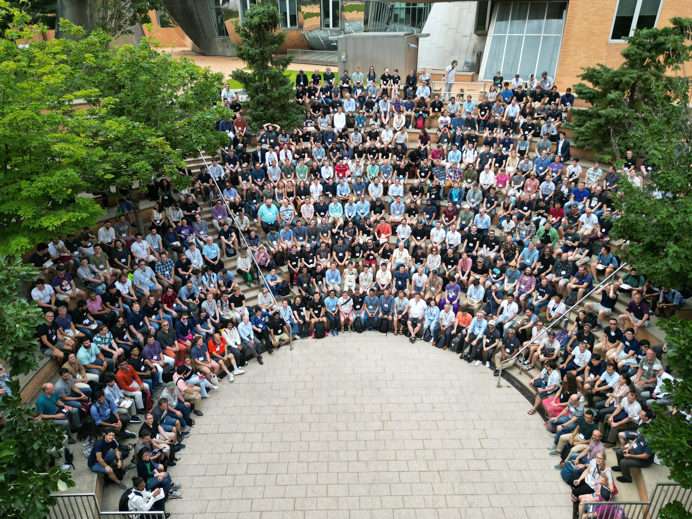

## Access

#### These Slides

https://danlooo.github.io/julia-introduction-ogh-summer-school-2026


#### Julia Terminal

https://www.jdoodle.com/online-compiler-julia

## Who is Julia?

::::: {.columns}

::: {.column width="60%"}
- High-performance programming language
- Designed for scientific computing
- Easy to learn, fast to run
- Dynamic typing like Python
- Speed approaching C
- Great for data science, math, and more
- Multi-paradigm: Functional, procedural, typed
:::

::: {.column width="40%"}

:::

:::::

## Why Julia?

- **Fast**: Just-in-time compilation, near-C performance
- **Easy**: Clean syntax, readable code
- **Dynamic**: Interactive REPL, flexible types
- **Ecosystem getting richer**: 10,000+ packages

## The Two Language Problem

::::: {.columns}

::: {.column width="60%"}
Usually, one needs two languages

- One to prototype: Python, R
- Another one to make it fast: C++, Fortran

This makes it complicated to write and debug.
:::

::: {.column width="40%"}

:::

:::::

## Julia Benchmarks

https://github.com/kadyb/raster-benchmark


## Julia Benchmarks

https://github.com/kadyb/vector-benchmark


## Getting Started

Install Julia:

```
curl -fsSL https://install.julialang.org | sh
```

Open terminal and type:

```bash
julia
```

You'll see the Julia REPL:

```
❯ julia        _
   _       _ _(_)_     |  Documentation: https://docs.julialang.org
  (_)     | (_) (_)    |
   _ _   _| |_  __ _   |  Type "?" for help, "]?" for Pkg help.
  | | | | | | |/ _` |  |
  | | |_| | | | (_| |  |  Version 1.12.5 (2026-02-09)
 _/ |\__'_|_|_|\__'_|  |  Official https://julialang.org release
|__/                   |

julia> println("Hello world")
Hello world
```

## Tips for Beginners

1. **Use the REPL** - Interactive and fast feedback
2. **Use `?` for help** - Type `?function_name` in REPL
3. **1-indexed arrays** - First element is `[1]`, not `[0]`
4. **Use `!` convention** - Functions ending in `!` modify arguments
5. **Multiple dispatch** - Julia's superpower!
6. **Use packages** - Don't reinvent the wheel

## Resources

- **Official docs**: https://docs.julialang.org
- **Discourse**: https://discourse.julialang.org
- **GitHub**: https://github.com/JuliaLang/julia
- **Learn X in Y**: https://learnxinyminutes.com/docs/julia/
- **YouTube**: https://www.youtube.com/@doggodotjl

## Variables

```julia
x = 10
y = 3.14
name = "Julia"
is_cool = true
```

- No type declaration needed
- Type inferred automatically
- Variable names are case-sensitive

## Unicode

Julia supports emojis which is essential in writing mathematical formulas:

```{julia}
👍=1
👎=-1
👍 + 👎
```


## Basic Types

| Type | Example | Description |
|------|---------|-------------|
| `Int64` | `42` | Integer |
| `Float64` | `3.14` | Floating point |
| `String` | `"hello"` | Text |
| `Bool` | `true` | Boolean |
| `Char` | `'a'` | Single character |

## Type Checking

```{julia}
#| output: text
typeof(42)
```
```{julia}
#| output: text
typeof(3.14)
```

```{julia}
#| output: text
typeof("hello")
```
```{julia}
#| output: text
typeof(true)
```

## Basic Operations

```{julia}
#| output: text
a = 5 + 3
```

```{julia}
#| output: text
b = 10 - 4
```

```{julia}
#| output: text
c = 3 * 7
```
```{julia}
#| output: text
d = 15 / 4
```
```{julia}
#| output: text
e = 15 ÷ 4
```
```{julia}
#| output: text
f = 2^10
```
```{julia}
#| output: text
g = 17 % 5
```

## String Operations

```{julia}
#| output: text
greeting = "Hello" * " " * "World"
the_name = "Julia"
msg = "I love $the_name !"
```
```{julia}
#| output: text
uppercase("hello")
```
```{julia}
#| output: text
lowercase("HELLO")
```
```{julia}
#| output: text
length("Julia")
```

## Arrays

```{julia}
#| output: text
numbers = [1, 2, 3, 4, 5]
mixed = [1, "two", 3.0]
empty = Int[]
first = numbers[1]
last = numbers[end]
numbers[1] = 10
push!(numbers, 6)
numbers
```

Matricies and other tensors:

```{julia}
rand(3, 4)
```

## Array Operations

```{julia}
#| output: text
using Statistics
arr = [1, 2, 3, 4, 5]
length(arr)
```
```{julia}
#| output: text
sum(arr)
```
```{julia}
#| output: text
mean(arr)
```
```{julia}
#| output: text
maximum(arr)
```
```{julia}
#| output: text
minimum(arr)
```
```{julia}
#| output: text
arr[2:4]
```

We start counting by 1 and not 0 in Julia:

```{julia}
#| output: text
arr[1:2]
```

## Broadcasting

Apply a function e.g. to every element of an array:

```{julia}
[1, 2, 3] .* 2
```

Repeat it over other dimensions:

```{julia}
[1 2 3; 4 5 6] .* [2 2 2]
```


## Broadcasting Performance

This is faster than `map` by doing it at compile time:

```{julia}
a = 1:10000000
@time a .* 2
```

```{julia}
@time map(x -> x * 2, a)
```

while giving same results:

```{julia}
all(map(x -> x * 2, a) .== a .* 2)
```

## Dictionaries

```{julia}
#| output: text
person = Dict(
    "name" => "Alice",
    "age" => 30,
    "city" => "Berlin"
)
```
```{julia}
#| output: text
person["name"]
person["job"] = "Engineer"
haskey(person, "age")
```

## If Statements

```{julia}
#| output: text
x = 10
if x > 5
    println("Big")
elseif x > 0
    println("Medium")
else
    println("Small")
end
```

Compact ternary operator:

```{julia}
#| output: text
result = x > 5 ? "Big" : "Small"
```

## For Loops

```{julia}
#| output: text
for i in 1:5
    println(i)
end
```
```{julia}
#| output: text
fruits = ["apple", "banana", "cherry"]
for fruit in fruits
    println(fruit)
end
```

List comprehensions:
```{julia}
#| output: text
squares = [x^2 for x in 1:5]
```

## While Loops

```{julia}
#| output: text
n = 1
while n <= 5
    println(n)
    n += 1
end
```
```{julia}
#| output: text
for i in 1:10
    if i == 3
        continue
    end
    if i == 7
        break
    end
    println(i)
end
```

## Functions

```{julia}
#| output: text
function greet(the_name)
    return "Hello, $the_name !"
end
```

Compact in-line definition:

```{julia}
#| output: text
greet(name) = "Hello, $the_name !"
greet("Alice")
```

## Piping

Similar to R, one can call multiple functions sequentially:

```{julia}
#| output: text
using Statistics
[1, 2, 3, missing] |> skipmissing |> mean
```


## The Main Paradigm of Julia: Multiple Dispatch

## Single Dispatch: The Object Orientated Way

How to make special methods if Julia is not object orientated?
In traditional R, one just creates type-specific methods somewhere:

```R
print.tbl_df <- function(x, verbose) {
    print("I am a tibble :)")
}

print.data.frame <- function(x, verbose) {
    print("Im just a data frame :(")
}
```

When called `print(data, TRUE)`, the method is called based on the type of the first function argument `x`.
This is called **single dispatch**.

In Python, this first function argument is often written before a dot: `my_object.print(True)` which is analog to `print(my_object, True)`

## Multiple Dispatch: The Julia Way

Julia allows to create methods not just on one but on **all** function arguments.
This is called **multiple dispatch**:

```{julia}
#| output: text
struct ComplexNumber
    real
    imag
end

Base.:+(a::Real, b::Real) = a + b
Base.:+(z::ComplexNumber, s::Real) = ComplexNumber(z.real + s, z.imag)
Base.:+(a::ComplexNumber, b::ComplexNumber) = ComplexNumber(a.real + b.real, a.imag + b.imag)
```

Now, `1 + 2` will be much faster than `ComplexNumber(3,4) + 5`.
Julia makes the shortcuts for us. We don't need to think about this.

##  Multiple Dispatch: The Julia Way

This is a feature for library developers.
You usually don't have to define them by yourself:

```{julia}
#| output: text
methods(Base.:+) |> length
```

```{julia}
#| output: text
methods(Base.:+)[1:5]
```

## Multiple Dispatch in Python

How about doing it manually in Python?

```python
def add(a,b):
    if type(a) == float and type(b) == float
        return add_float_float(a, b)
    elif type(a) == float and type(b) == int
        return add_float_int(a,b)
```

- yes, this is multiple dispatch
- but: In Julia, this happens often at compile time without any runtime cost
- this is a major reason why Julia is both flexible and fast

## Type Composition

- Julia is functional and not object-orientated
- is more similar to C than Python, C++
- there is no encapsulated classes in Julia
- one creates structures with fields but no methods instead

```{julia}
#| output: text
struct Foo
    bar
    baz::Int
    qux::Float64
end
foo = Foo("Hello, world.", 23, 1.5)
```

```{julia}
#| output: text
foo.baz + 1
```

## Abstract Types
- Types may have parent types
- Useful e.g. to get both int and float numbers 

```{julia}
#| output: text
1.5 isa Float64
```

```{julia}
#| output: text
1.5 isa Number
```

```{julia}
#| output: text
1.5 |> typeof |> supertypes
```


## Functions with Types

```{julia}
#| output: text
function add(x::Int, y::Int)::Int
    return x + y
end
function describe(x::Int)
    println("$x is an integer")
end
function describe(x::String)
    println("$x is a string")
end
describe(42)
describe("hi")
```

## Default and Keyword Arguments

```{julia}
#| output: text
function power(base, exp=2)
    return base^exp
end
power(3)
power(3, 3)
function plot(x; color="blue", width=1)
    println("Color: $color, Width: $width")
end
plot([1, 2, 3], color="red", width=2)
```

## Packages

```{julia}
#| output: text
#| eval: false

using Pkg
Pkg.add("DataFrames")
```

Browse packages online: https://juliapackages.com

## Useful Packages

| Package | Purpose |
|---------|---------|
| `Plots` | Plotting and visualization |
| `DataFrames` | Data manipulation |
| `CSV` | Read/write CSV files |
| `Statistics` | Statistical functions |
| `LinearAlgebra` | Matrix operations |
| `Random` | Random numbers |
| `Dates` | Date/time handling |

## Working with Files

```{julia}
#| output: text
open("output.txt", "w") do f
    write(f, "Hello, File!\n")
    write(f, "Second line\n")
end
content = read("output.txt", String)
println(content)
for line in eachline("output.txt")
    println(line)
end
```

## Error Handling

```{julia}
#| output: text
try
    result = 10 / 0
catch e
    println("Error: ", e)
finally
    println("This always runs")
end
function check_positive(x)
    if x < 0
        throw(DomainError(x, "Must be positive"))
    end
    return x
end
check_positive(5)
```

## Macros

Macros can modify code before compilliation:

```{julia}
macro sayhello()
    return :(println("Hello, world!"))
end
@sayhello()
```

- Similar to Pythons decorators, but not only for functions
- Often used to automatically write repetetive code
- Also used to temporarily modify code e.g. `@benchmark`

## Metaprogramming

Lisp-like macros and other metaprogramming facilities. Julia represents its own code as a data structure of the language itself. This enables macros, but in the end *anything* you can think of. We've used it to generate thousands of lines of code that would normally have to be handwritten. It's really programming your programming.

```{julia}
# Everything's a string first
prog = "1 + 1"
ex1 = Meta.parse(prog)
println("$(typeof(ex1)) $ex1")

# An expression has a head and args
println(ex1.head)
println(ex1.args)

# You can create this yourself as well
ex2 = Expr(:call, :+, 1, 1)
ex2 == ex1
```

## Community: JuliaCon Global



## Community: JuliaGeo

https://github.com/JuliaGeo


## Summary

- Julia is fast and easy to learn
- Great for scientific computing
- Clean, readable syntax
- Powerful package ecosystem
- Multiple dispatch is unique
- Active, friendly community

## Questions?

**Thank you!**

Start coding in Julia today!